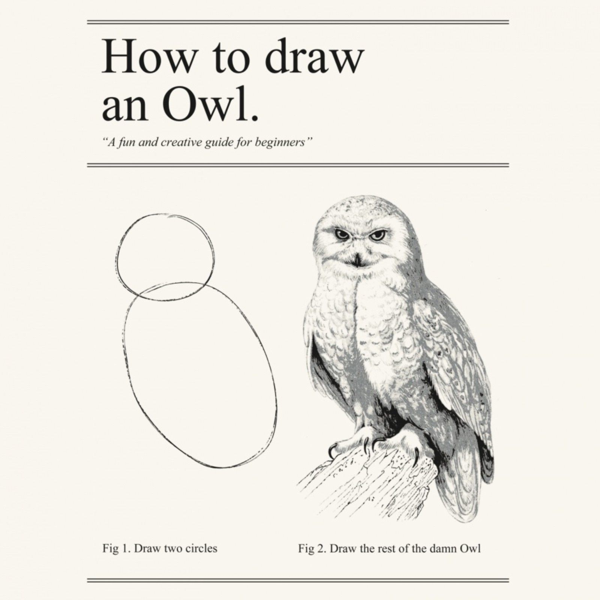

# Parser Combinators
## +
# 

<!-- _footer: "**Konrad Biernacki**, 2023" -->

<!-- - What they are -->
<!-- - How we can write them ourselves -->
<!-- - When to use them -->

---

## Konrad Biernacki
Mobile Developer 

---

<style scoped>
pre { font-size: 56px; }
</style>

```yml
height: 100
name: kotlin
```

<!-- - Here's some arbitrary syntax -->
<!-- - Assume it is the format of some runtime configuration we are asked to apply to our project, how would we approach parsing this? -->

<!-- footer: "**Konrad Biernacki**, 2023" -->

---

<style scoped>
pre { font-size: 24px; }
</style>

```kotlin
fun parse(input: String): List<Pair<String, String>> {
    var index = 0
    val pairs = mutableListOf<Pair<String, String>>()
    var currentToken = ""
    var firstToken = ""
    while (index < input.length) {
        when (input[index]) {
            ' ' -> Unit
            ':' -> {
                firstToken = currentToken
                currentToken = ""
            }
            '\n' -> {
                pairs.add(firstToken to currentToken)
                firstToken = ""
                currentToken = ""
            }
            else -> currentToken += input[index]
        }
        if (index == input.length - 1) pairs.add(firstToken to currentToken)
        index++
    }
    return pairs
}
```

<!-- - Naïve -->
<!-- - Efficient -->
<!-- - Prohibitively expensive to maintain -->

---

<style scoped>
    pre { font-size: 32px; }
</style>

```kotlin
fun parse(input: String): List<Pair<String, String>> {
    return Regex("(\\w+):\\s(\\w+)").findAll(input)
        .map { it.groupValues.drop(1) }
        .map { it.get(0) to it.get(1) }
        .toList()
}
```

<!-- - Simpler to understand -->
<!-- - Improved maintainability -->
<!-- - Regular Expressions may not be universally understood -->

---

<style scoped>
    pre { font-size: 32px; }
</style>

```kotlin
fun parse(input: String): List<Pair<String, String>> {
    return input.lines()
        .map {
            it.split(": ").let {
                it.get(0) to it.get(1)
            }
        }
}
```

<!-- - Extremely simple -->
<!-- - Trivial to debug -->
<!-- - The issue of maintainability still exists -->

---

<style scoped>
pre { font-size: 56px; }
</style>

```diff
-   height: 100
+   height: 100.5
+   ratio: 16:9
    name: kotlin
```

<!-- - Certain implementations may choke on the non-alphanumeric character or reappearance of the separator -->
<!-- - Values may be more meaningful than a simple string, what about treating them as different data types? (i.e. decimal, etc.) -->

---

<style scoped>
pre { font-size: 56px; }
</style>

```diff
    height: 100.5
    ratio: 16:9
-   name: kotlin
+   name: kotlin;
```

<!-- - Syntax flexibility -->

---

<style scoped>
pre { font-size: 56px; }
</style>

```diff
    height: 100.5
    ratio: 16:9
    name: kotlin;
+   role : admin
```

<!-- - Syntax flexibility cont. -->

# ...

---

<style scoped>
h3 {
    position: absolute;
    top: 30px;
    left: 70px;
    right: 70px;
}
</style>

### There's got to be a better way!


---

https://en.wikipedia.org/wiki/Parser_combinator

<br />

> A _parser combinator_ is a **higher-order function** that accepts several parsers as input and returns a new parser as its output. 
[...]
_Parser combinators_ enable a recursive descent parsing strategy that facilitates **modular piecewise construction and testing**.

---

<style scoped>
pre { font-size: 32px; }
</style>

```kotlin
val configParser = zeroOrMore(
    zip(
        keyParser,
        separatorParser,
        valueParser,
    )
)

configParser(input)
```

<!-- - Six parsers seen here -->
<!-- - Demonstrates composition -->
<!-- - We're going to learn how to write a working version of this -->

---



<!-- _footer: "" -->

---

<style scoped>
pre { font-size: 32px; }
</style>

```kotlin
fun interface Parser<Output> {
    operator fun invoke(input: String): Result<Output>
}
```

---

<style scoped>
pre { font-size: 32px; }
</style>

```kotlin
fun <A, B, C, D, E, F, G, H, I> zip(
    a: Parser<A>,
    b: Parser<B>,
    c: Parser<C>,
    d: Parser<D>,
    e: Parser<E>,
    f: Parser<F>,
    g: Parser<G>,
    h: Parser<H>,
    i: Parser<I>,
): Parser<Tuple9<A, B, C, D, E, F, G, H, I>>
```

---

<style scoped>
pre { font-size: 6px; }
</style>

```kotlin
fun <A, B, C> zip(
    a: Parser<A>,
    b: Parser<B>,
    c: Parser<C>
): Parser<Tuple3<A, B, C>> = zip(a, zip(b, c))
    .map { (a, bc) ->
        Tuple3(a, bc.first, bc.second)
    }

fun <A, B, C, D> zip(
    a: Parser<A>,
    b: Parser<B>,
    c: Parser<C>,
    d: Parser<D>
): Parser<Tuple4<A, B, C, D>> = zip(a, zip(b, c, d))
    .map { (a, bcd) ->
        Tuple4(a, bcd.first, bcd.second, bcd.third)
    }

fun <A, B, C, D, E> zip(
    a: Parser<A>,
    b: Parser<B>,
    c: Parser<C>,
    d: Parser<D>,
    e: Parser<E>
): Parser<Tuple5<A, B, C, D, E>> = zip(a, zip(b, c, d, e))
    .map { (a, bcde) ->
        Tuple5(a, bcde.first, bcde.second, bcde.third, bcde.fourth)
    }

fun <A, B, C, D, E, F> zip(
    a: Parser<A>,
    b: Parser<B>,
    c: Parser<C>,
    d: Parser<D>,
    e: Parser<E>,
    f: Parser<F>
): Parser<Tuple6<A, B, C, D, E, F>> = zip(a, zip(b, c, d, e, f))
    .map { (a, bcdef) ->
        Tuple6(a, bcdef.first, bcdef.second, bcdef.third, bcdef.fourth, bcdef.fifth)
    }

fun <A, B, C, D, E, F, G> zip(
    a: Parser<A>,
    b: Parser<B>,
    c: Parser<C>,
    d: Parser<D>,
    e: Parser<E>,
    f: Parser<F>,
    g: Parser<G>
): Parser<Tuple7<A, B, C, D, E, F, G>> = zip(a, zip(b, c, d, e, f, g))
    .map { (a, bcdefg) ->
        Tuple7(a, bcdefg.first, bcdefg.second, bcdefg.third, bcdefg.fourth, bcdefg.fifth, bcdefg.sixth)
    }

fun <A, B, C, D, E, F, G, H> zip(
    a: Parser<A>,
    b: Parser<B>,
    c: Parser<C>,
    d: Parser<D>,
    e: Parser<E>,
    f: Parser<F>,
    g: Parser<G>,
    h: Parser<H>
): Parser<Tuple8<A, B, C, D, E, F, G, H>> = zip(a, zip(b, c, d, e, f, g, h))
    .map { (a, bcdefgh) ->
        Tuple8(a, bcdefgh.first, bcdefgh.second, bcdefgh.third, bcdefgh.fourth, bcdefgh.fifth, bcdefgh.sixth, bcdefgh.seventh)
    }

fun <A, B, C, D, E, F, G, H, I> zip(
    a: Parser<A>,
    b: Parser<B>,
    c: Parser<C>,
    d: Parser<D>,
    e: Parser<E>,
    f: Parser<F>,
    g: Parser<G>,
    h: Parser<H>,
    i: Parser<I>
): Parser<Tuple9<A, B, C, D, E, F, G, H, I>> = zip(a, zip(b, c, d, e, f, g, h, i))
    .map { (a, bcdefghi) ->
        Tuple9(a, bcdefghi.first, bcdefghi.second, bcdefghi.third, bcdefghi.fourth, bcdefghi.fifth, bcdefghi.sixth, bcdefghi.seventh, bcdefghi.eighth)
    }
```

---

<style scoped>
pre { font-size: 42px; }
</style>

```kotlin
fun <A, B> Parser<A>.flatMap(
    transform: (A) -> Parser<B>,
): Parser<B>
```

<!-- - `flatMap` permits the output of a successfully executed parser to be transformed into another successful parser, or a failed parser -->

---

<style scoped>
pre { font-size: 28px; }
</style>

```kotlin
fun <Output> always(constant: Output): Parser<Output>

fun <Output> never(): Parser<Output>

fun <Output> maybe(parser: Parser<Output>): Parser<Maybe<Output>>
```

<!-- - These parsers are useful when flat-mapping -->
<!-- - You may imagine an instance when, based on some parser's output, you may switch on some complex logic to either succeed or fail -->
<!-- - The `maybe` parser is one such parser that successfully completes, but may require more behaviour built off it to interpret its outcome -->

---

<style scoped>
pre { font-size: 36px; }
</style>

```kotlin
fun <Output, SeparatedBy> zeroOrMore(
    parser: Parser<Output>,
    separatedBy: Parser<SeparatedBy>?,
): Parser<List<Output>>

fun <Output, SeparatedBy> oneOrMore(
    parser: Parser<Output>,
    separatedBy: Parser<SeparatedBy>?,
): Parser<List<Output>>
```

<!-- - Very often I found myself writing `zeroOrMore` and `oneOrMore` parsers with separators in mind -->
<!-- - Here's an example of supporting that use-case in the API for these parsers -->

---

<style scoped>
pre { font-size: 24px; }
</style>

```kotlin
fun <Output> oneOf(parsers: List<Parser<out Output>>): Parser<Output>
fun <Output> notOneOf(parsers: List<Parser<Output>>): Parser<Unit>

fun prefix(predicate: (Char) -> Boolean): Parser<String>
```

<!-- - `oneOf` and `notOneOf` accept a list of parsers and considers itself successful on the first matching parser -->
<!-- - `prefix` is an ergonomic parser-builder which parses while a given predicate returns true. Similar to a `takeWhile` -->

---

<style scoped>
pre { font-size: 32px; }
</style>

```graphql
query HeroForEpisode($ep: Episode!) {
    hero(episode: $ep) {
        name
        ... on Droid {
            primaryFunction
        }
        ... on Human {
            height
        }
    }
}
```

---

<style scoped>
pre { font-size: 18px; }
</style>

```
Document(
    definitions = [
        DefinitionExecutable(
            definition = ExecutableDefinitionOperation(
                definition = OperationDefinitionOperation(
                    definition = Operation(
                        operationType = QUERY, 
                        name = HeroForEpisode, 
                        variableDefinitions = [
                            VariableDefinition(
                                variable = ep, 
                                type = Episode!!, 
                                defaultValue = null
                            )
                        ], 
                        directives = [],
                        selectionSet = [
                            SelectionField(
                                selection = Field(
                                    alias = null, 
                                    name = hero, 
                                    arguments = [
                                        Argument(
                                            name = episode,
                                            value = ValueVariable(name = ep)
                                        )
                                    ], 
// ...
```

---

## [github.com/kgbier](https://github.com/kgbier)

###### [graphql-parser-kotlin](https://github.com/kgbier/graphql-parser-kotlin)
###### [graphql-parser-swift](https://github.com/kgbier/graphql-parser-swift)
###### This talk + exercises: [parser-combinators](https://github.com/kgbier/parser-combinators)
